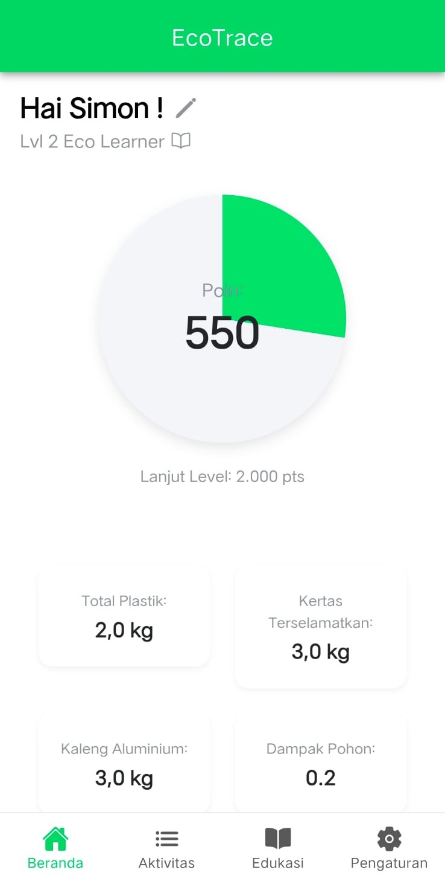
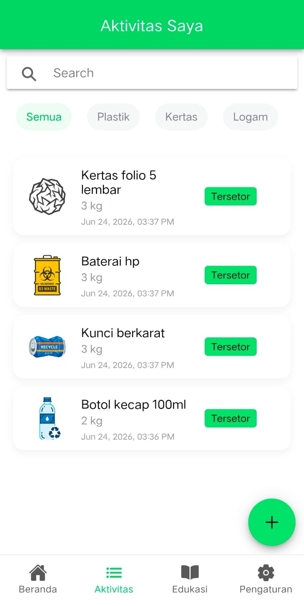
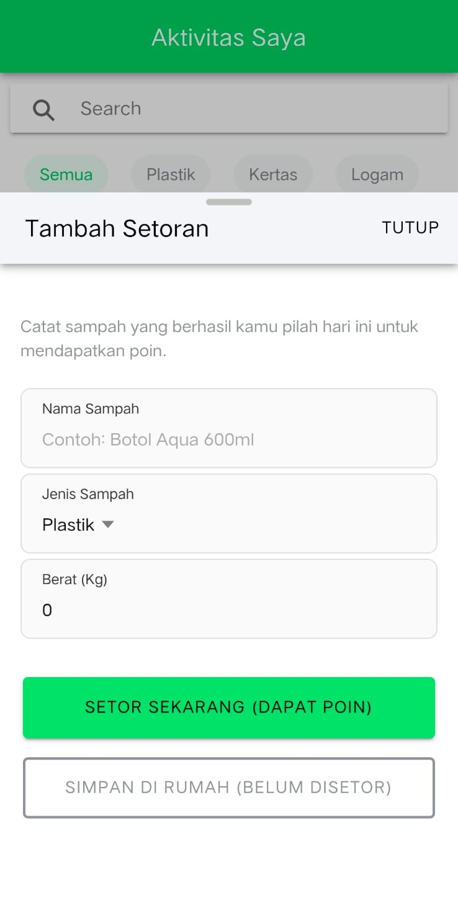
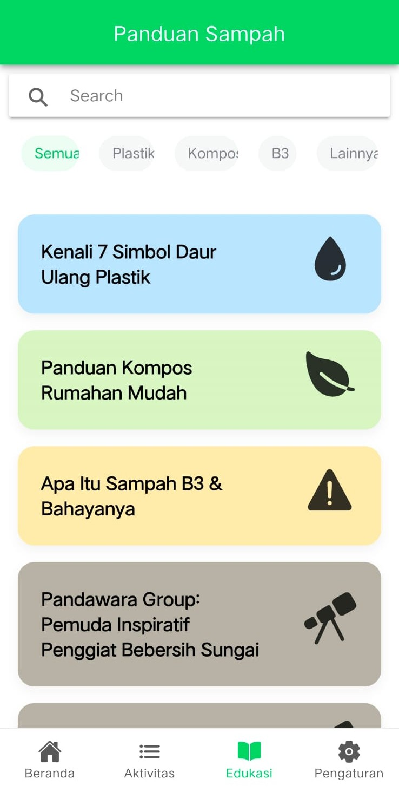
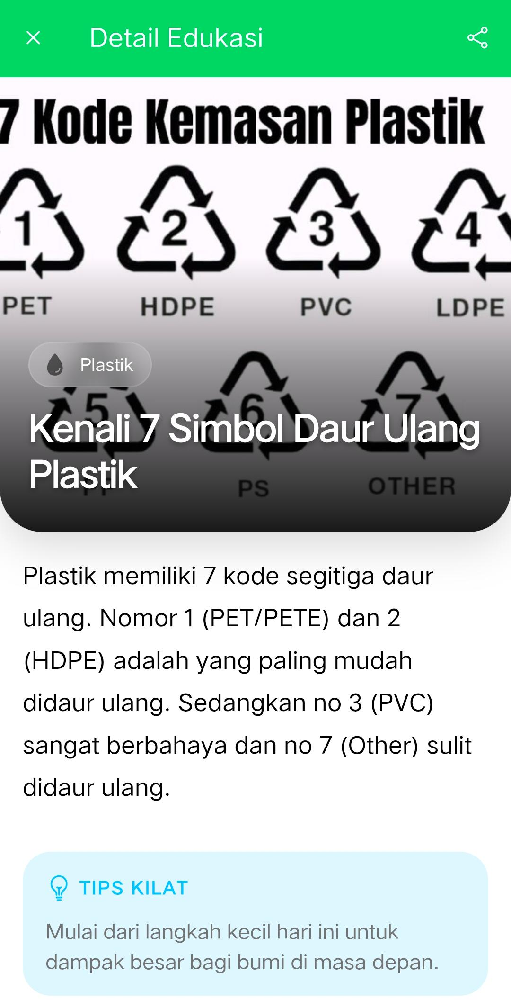
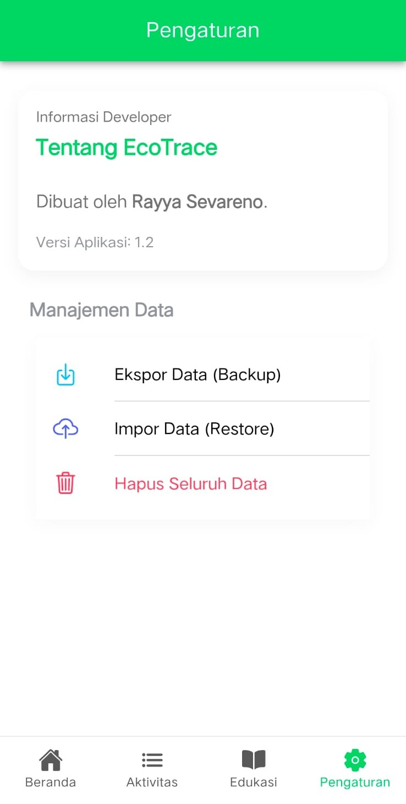

# EcoTrace 🌱 - Aplikasi Setoran Sampah Mobile

EcoTrace adalah aplikasi mobile berbasis **Ionic Angular** yang dirancang untuk membantu masyarakat mencatat, mengelola, dan memantau aktivitas setoran sampah rumah tangga (seperti Plastik, Kertas, Logam, dan B3). Melalui pendekatan gamifikasi (leveling dan akumulasi poin), EcoTrace memotivasi pengguna untuk memilah sampah dari sumbernya demi berkontribusi langsung pada kelestarian lingkungan.

---

## 🚀 Fitur Utama Aplikasi

### 1. Dashboard Beranda (Gamifikasi & Statistik Dampak)
*   **Personalisasi Nama Pengguna:** Input nama panggilan saat aplikasi pertama kali dibuka (profil default: *Warga Bumi*) yang dapat diubah kapan saja di menu Pengaturan atau langsung dari halaman Beranda.
*   **Sistem Leveling & Poin:** 
    *   Setiap sampah berstatus **Tersetor** menghasilkan poin dengan formula: `Berat (kg) × 50 Poin`.
    *   Sistem level dinamis (Level 1 s.d. Level 8+) dengan gelar bertingkat (*Eco Beginner*, *Eco Learner*, *Eco Scout*, *Eco Ranger*, *Eco Protector*, *Eco Guardian*, *Eco Master*, hingga *Eco Warrior*).
    *   *Circular Progress Bar* interaktif yang menghitung secara visual persentase poin menuju level berikutnya.
*   **Statistik Real-time:** Menampilkan rangkuman total sampah tersetor berdasarkan kategori utama (Plastik, Kertas, Logam) serta perhitungan estimasi dampak lingkungan (misal: estimasi jumlah pohon yang diselamatkan berdasarkan jumlah kertas yang didaur ulang).
*   **Tips Ramah Lingkungan Harian (Daily Tips):** Tips lingkungan dinamis yang dirotasi secara otomatis setiap hari menggunakan algoritma penanggalan (*date seed*).

### 2. Manajemen Aktivitas Setoran Sampah
*   **Pencatatan Fleksibel:** Pengguna dapat menambahkan setoran sampah dengan mengisi nama sampah, memilih kategori (Plastik, Kertas, Logam, B3), berat sampah (kg), dan status penyimpanan:
    *   `Tersetor`: Langsung menambah poin dan data statistik.
    *   `Tersimpan`: Sampah baru dipilah dan disimpan di rumah (belum disetor, tidak menambah poin/statistik hingga statusnya diubah menjadi Tersetor).
*   **Bottom Sheet Form Modal:** Antarmuka modern menggunakan modal bottom sheet Ionic yang responsif dan menghemat ruang navigasi halaman.
*   **Pencarian & Filter Cepat:** Kotak pencarian nama sampah secara real-time dan tab filter kategori (*Semua*, *Plastik*, *Kertas*, *Logam*, *B3*).
*   **Sistem Hapus Massal (Multi-Select):** Fitur *long-press* pada salah satu item di daftar aktivitas untuk mengaktifkan mode seleksi massal sehingga pengguna dapat memilih beberapa log setoran sekaligus dan menghapusnya secara efisien.

### 3. Edukasi Daur Ulang & Eco-Lifestyle
*   **Modul Pembacaan Artikel:** Daftar artikel edukasi terintegrasi, seperti:
    *   *Kenali 7 Simbol Daur Ulang Plastik* (PET, HDPE, PVC, dll.).
    *   *Panduan Kompos Rumahan Mudah*.
    *   *Apa itu Sampah B3 & Bahayanya*.
    *   *Kisah Inspiratif Pandawara Group*.
    *   *Panduan Memilah Sampah dari Rumah*.
*   **Detail Artikel dengan Cover Menarik:** Antarmuka detail artikel yang dilengkapi dengan layout *hero image* transparan dan kategori chip berwarna.
*   **Integrasi Native Share:** Membagikan artikel edukasi ke aplikasi media sosial / chat lain menggunakan Capacitor Share API (`@capacitor/share`).

### 4. Pengaturan & Utilitas Data (Backup-Restore)
*   **Ekspor Data:** Mengekspor seluruh riwayat aktivitas dan informasi poin pengguna ke dalam bentuk file JSON (`ecotrace-data-backup.json`). Mendukung export langsung ke memori internal perangkat pada mode native (menggunakan *Capacitor FileSaver plugin*) dan fallback unduhan otomatis pada browser.
*   **Impor Data:** Memulihkan/mengimpor data riwayat setoran dari file JSON backup untuk mempermudah migrasi data ke perangkat lain.
*   **Reset Aplikasi:** Menghapus seluruh data lokal secara aman dengan dialog konfirmasi berlapis untuk mencegah kehilangan data secara tidak sengaja.

---

## 🛠️ Arsitektur & Teknologi

*   **Framework Core:** Angular 20 & Ionic Framework 8
*   **Runtime Mobile:** Capacitor v8 (mendukung Android & iOS)
*   **Bahasa Pemrograman:** TypeScript, HTML5, SCSS
*   **State & Penyimpanan:** Penyimpanan lokal terpusat menggunakan `LocalStorage` dengan sistem migrasi data otomatis (menggabungkan skema data lama seperti *ecotrace_username* dan *ecotrace_activities* ke dalam satu objek toko data terstruktur).
*   **Integrasi Native:**
    *   `@capacitor/share` untuk berbagi artikel.
    *   `@capacitor/filesystem` & custom `FileSaver` plugin untuk penyimpanan cadangan data lokal.
    *   `@capacitor/splash-screen` untuk optimalisasi startup aplikasi.

---

## 📂 Struktur Direktori Utama

```bash
EcoTrace/
├── android/                   # Konfigurasi platform Android
├── ios/                       # Konfigurasi platform iOS
├── src/
│   ├── app/
│   │   ├── beranda/           # Halaman Dashboard, Profil, Leveling, & Tips Harian
│   │   ├── aktivitas/         # Halaman Daftar Setoran Sampah, Search, & Multi-select
│   │   │   └── tambah/        # Komponen Modal Bottom Sheet Tambah/Edit Setoran
│   │   ├── edukasi/           # Halaman List Artikel Edukasi
│   │   │   └── baca/          # Komponen Modal Baca Detail Artikel & Share
│   │   ├── pengaturan/        # Halaman Manajemen Data (Ubah Profil, Ekspor, Impor, Reset)
│   │   ├── services/
│   │   │   └── data.ts        # DataService utama (Logika Poin, Get/Set LocalStorage, Migrasi, & Impor/Ekspor)
│   │   ├── guards/            # Route guards (jika diperlukan)
│   │   ├── tabs/              # Konfigurasi Navigasi Tab Bar Utama
│   │   ├── app.module.ts      # Modul root aplikasi
│   │   └── app-routing.module # Routing modular Angular
│   ├── assets/
│   │   ├── data/
│   │   │   └── education.json # Data statis artikel edukasi lingkungan
│   │   └── images/            # Asset gambar cover edukasi dan UI preview
│   └── theme/
│       └── variables.css      # Variabel warna tema utama (Eco-green/Teal palette)
└── capacitor.config.ts        # Konfigurasi Capacitor native runtime
```

---

## 💻 Panduan Instalasi & Menjalankan Aplikasi

### Prasyarat
Pastikan Anda sudah menginstal perangkat lunak berikut di komputer Anda:
*   [Node.js](https://nodejs.org/) (versi LTS direkomendasikan)
*   [Ionic CLI](https://ionicframework.com/docs/cli) (`npm install -g @ionic/cli`)

### Langkah-Langkah Menjalankan
1.  **Clone Repositori dan Masuk ke Folder Projek**
    ```bash
    cd EcoTrace
    ```

2.  **Instalasi Dependensi**
    ```bash
    npm install
    ```

3.  **Jalankan di Mode Pengembangan (Browser)**
    ```bash
    ionic serve
    ```
    Aplikasi akan berjalan secara otomatis di browser pada alamat `http://localhost:8100`.

4.  **Menjalankan di Emulator / Perangkat Android**
    *   Build aplikasi web terlebih dahulu:
        ```bash
        ionic cap build android
        ```
    *   Sinkronisasikan file aset ke folder Android Capacitor:
        ```bash
        ionic cap sync android
        ```
    *   Buka proyek di Android Studio untuk melakukan kompilasi APK atau menjalankan langsung di HP:
        ```bash
        ionic cap open android
        ```

---

## 🎨 Review Antarmuka Pengguna (UI Review)

> [!NOTE]
> *Bagian ini menyajikan tinjauan desain antarmuka aplikasi EcoTrace. Silakan ganti placeholder gambar di bawah ini dengan screenshot UI aktual aplikasi Anda.*

### 📊 1. Halaman Beranda (Dashboard)

| Area Tampilan | Screenshot |
|---|---|
| **Beranda / Dashboard Utama**<br>Menyajikan personalisasi sapaan pengguna, indikator level dengan ikon dinamis, serta circular progress bar untuk akumulasi poin. Di bawahnya terdapat grid statistik tersetor dan kartu tips harian berwarna kuning kontras. |  |

*   **Analisis Desain UI:**
    *   **Keseimbangan Informasi:** Penempatan *Circular Progress Bar* di tengah layar memberikan fokus visual instan kepada pengguna mengenai kemajuan level ramah lingkungan mereka.
    *   **Palet Warna:** Menggunakan warna hijau mint (`primary`) sebagai representasi kelestarian alam dan warna kuning hangat (`warning`) pada kartu tips untuk memicu perhatian pengguna tanpa merusak estetika desain.
    *   **Tipografi:** Judul besar nama pengguna memberikan sentuhan personal yang ramah saat aplikasi dibuka.

---

### 📝 2. Halaman Aktivitas Setoran

| Area Tampilan | Screenshot |
|---|---|
| **Daftar Aktivitas Setoran**<br>Halaman utama daftar aktivitas dengan kolom pencarian, filter chips untuk menyaring jenis sampah, serta daftar kartu item sampah yang informatif. |  |

*   **Analisis Desain UI:**
    *   **Filter Chips:** Penggunaan tombol filter pipih (chips) di bagian atas list mempercepat penyaringan kategori sampah tanpa memakan banyak tempat.
    *   **Mode Multi-Select:** Interaksi long-press pada daftar item memberikan efek visual transisi seleksi (checkbox centang) dan memicu kemunculan tombol hapus massal di toolbar atas secara halus.

---

### 📋 3. Form Bottom Sheet Setoran

| Area Tampilan | Screenshot |
|---|---|
| **Form Tambah/Edit Setoran**<br>Antarmuka pengisian data sampah baru menggunakan bottom sheet modal setengah layar dengan field Nama Sampah, Kategori, Berat (Kg), serta tombol opsi simpan/setor. |  |

*   **Analisis Desain UI:**
    *   **Bottom Sheet Form:** Menggunakan *sheet modal* dengan breakpoint `0.8` sehingga pengguna tidak kehilangan konteks halaman belakang saat mengisi data. Struktur form minimalis dan memiliki validasi input otomatis yang langsung memunculkan pesan error berwarna merah jika input kosong.

---

### 📚 4. Halaman Edukasi

| Area Tampilan | Screenshot |
|---|---|
| **Edukasi Daur Ulang**<br>List artikel dikemas dalam bentuk kartu visual (card) yang bersih, lengkap dengan icon kategori, judul artikel, cuplikan konten singkat, serta indikasi estimasi waktu membaca. |  |

*   **Analisis Desain UI:**
    *   **Desain Kartu (Cards):** Penataan artikel dengan grid satu kolom yang lebar memberikan ruang visual yang cukup bagi setiap artikel untuk menonjolkan cover gambarnya.

---

### 📖 5. Detail Edukasi

| Area Tampilan | Screenshot |
|---|---|
| **Baca Detail Artikel**<br>Saat artikel dibuka, modal menyajikan gambar hero besar dengan overlay judul transparan, diikuti dengan konten artikel lengkap, kartu "Tips Kilat" dan tombol native share. |  |

*   **Analisis Desain UI:**
    *   **Visual Imersif:** Penggunaan gambar header dengan overlay gelap transparan membuat teks judul artikel putih tetap terbaca jelas (kontras tinggi) sekaligus mempertahankan keindahan foto latar belakang.
    *   **Keterbacaan (Readability):** Tata letak teks isi artikel menggunakan margin yang lebar untuk kenyamanan mata pengguna saat membaca paragraf panjang pada layar handphone.

---

### ⚙️ 6. Halaman Pengaturan (Settings)

| Area Tampilan | Screenshot |
|---|---|
| **Pengaturan Aplikasi**<br>Menyediakan serangkaian menu tertata rapi untuk melakukan perubahan nama profil, pencadangan (ekspor/impor) data lokal, serta tombol reset data dengan peringatan bahaya. |  |

*   **Analisis Desain UI:**
    *   **Ikonografi Konsisten:** Setiap menu dihiasi oleh ikon Ionicons yang representatif dengan warna senada untuk memudahkan navigasi cepat.
    *   **Hierarki Aksi:** Tombol dengan risiko tinggi seperti "Hapus Seluruh Data" diletakkan dengan warna merah menyala (`danger`) dan memerlukan konfirmasi melalui alert pop-up agar pengguna tidak menekan tombol tersebut secara tidak sengaja.

---

## 📄 Lisensi

Aplikasi ini dilisensikan di bawah **MIT License** - bebas digunakan dan dikembangkan untuk kepentingan edukasi dan sosial.

*EcoTrace - Menjaga Bumi, Satu Setoran Sekaligus.* 🌍
